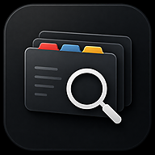

  

# DDF-Tracker ist umgezogen

Dieses Repository enthält nur noch die Umzugsseite des früheren **DDF-Trackers**.

Die aktuelle App heißt **Die Fallkartei** und wird im neuen Repository weiterentwickelt.

[**Die Fallkartei öffnen**](https://letsmagic.github.io/fallkartei/) ·
[**Neues Repository ansehen**](https://github.com/LetsMAgic/fallkartei)

---

## Neue App installieren

### iPhone und iPad

1. [Die Fallkartei in Safari öffnen](https://letsmagic.github.io/fallkartei/)
2. Auf das Teilen-Symbol tippen
3. **Zum Home-Bildschirm** auswählen
4. Mit **Hinzufügen** bestätigen
5. Das alte DDF-Tracker-Symbol anschließend entfernen

### Android

1. [Die Fallkartei öffnen](https://letsmagic.github.io/fallkartei/)
2. Das Browsermenü öffnen
3. **App installieren** oder **Zum Startbildschirm hinzufügen** wählen
4. Das alte DDF-Tracker-Symbol anschließend entfernen

## Persönliche Daten

Lokal gespeicherte Bewertungen, Playlists und Notizen sollten in der neuen App weiterhin verfügbar sein.
Ein vorhandenes JSON-Backup sollte dennoch aufbewahrt werden.

## Projektstatus

Der DDF-Tracker wird nicht mehr weiterentwickelt. Dieses Repository bleibt ausschließlich als
dauerhafter Hinweis für bisherige Nutzer bestehen.

---

> Inoffizielles, nicht kommerzielles Fanprojekt. „Die drei ???“ sowie zugehörige Marken,
> Titel, Cover, Illustrationen und andere geschützte Inhalte gehören den jeweiligen Rechteinhabern.
